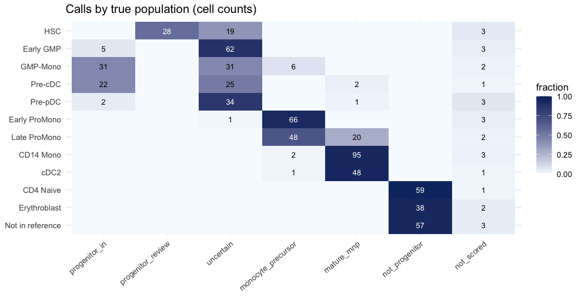
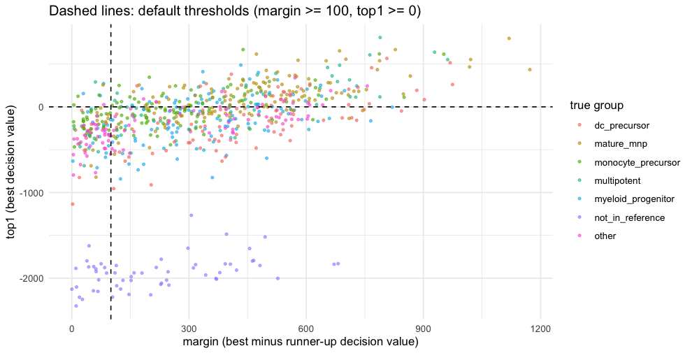
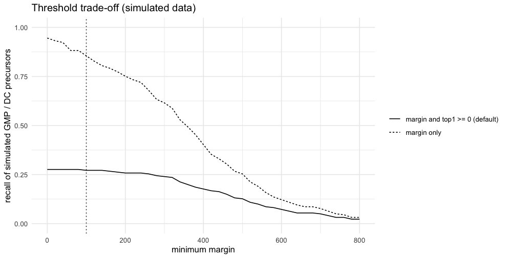

progenitor-score: a worked example on simulated data (R)
================

`progenitor-score` scores every cell against the **BoneMarrowMap** atlas
(Zeng et al., *Blood Cancer Discovery* 2025;6:307-24) and returns the
best-matching bone-marrow state, a group, and a call that says whether a
cell is a progenitor you may want to keep (for example when extracting
monocytes, macrophages and DCs from a public dataset).

This report uses **simulated counts with known labels**
(`examples/data/`, made by `examples/simulate_counts.py`). It shows how
to call the tool from R, on a plain matrix and on a Seurat object, and
how the calls behave on clean, transitional, out-of-reference and
low-depth cells. **It is a plumbing and behaviour check, not an accuracy
estimate**: the simulated profiles are averages of the atlas the model
was trained on, so real cells will do worse. Accuracy on 9 held-out real
donors is in `docs/validation/`. The Python notebook
(`progenitor_score_demo.ipynb`) runs the same steps; section 6 checks
that the two give identical answers.

Requirements: **raw counts** (not normalised), gene **symbols** as row
names, ideally a QC flag per cell.

## 1. Load the package and the data

``` r
library(Matrix); library(ggplot2)
if (requireNamespace("progenitorscore", quietly = TRUE)) {            # installed:  remotes::install_github("finlay-immuno-lab/progenitor-score")
  library(progenitorscore)
} else {
  source("../R/progenitor_score.R")                                  # or run from a repository checkout
}
counts <- readMM(gzfile("data/sim_counts.mtx.gz"))                    # genes x cells, sparse
genes  <- readLines("data/sim_genes.tsv"); cells <- read.csv("data/sim_cells.csv", stringsAsFactors = FALSE)
cells$qc_pass <- as.logical(cells$qc_pass)                            # written by Python as "True"/"False"
dimnames(counts) <- list(genes, cells$cell)
counts <- as(counts, "CsparseMatrix")
cat(sprintf("%d genes x %d cells; integer counts: %s; max count: %d\n", nrow(counts), ncol(counts),
            all(counts@x == round(counts@x)), max(counts@x)))
```

    ## 3497 genes x 730 cells; integer counts: TRUE; max count: 4004

``` r
head(cells[, c("cell", "true_population", "umis", "qc_pass")], 4)
```

    ##       cell true_population umis qc_pass
    ## 1 cell0000             HSC  927    TRUE
    ## 2 cell0001             HSC 1714    TRUE
    ## 3 cell0002             HSC 2598    TRUE
    ## 4 cell0003             HSC 2299    TRUE

## 2. Score a matrix

`bmps_score()` takes a genes x cells matrix (dense or sparse) with
symbols as row names and returns one row per cell. `qc` is a logical
vector; cells that are `FALSE` are not scored.

``` r
res <- bmps_score(counts, qc = cells$qc_pass, quiet = TRUE)            # defaults: min_margin = 100, min_top1 = 0
head(cbind(true_population = cells$true_population, res), 6)
```

    ##          true_population bm_state runner_up       top1   margin    bm_group
    ## cell0000             HSC      HSC MPP-MkEry -330.49901 126.1558 multipotent
    ## cell0001             HSC      HSC  MPP-MyLy  -56.83607 306.0834 multipotent
    ## cell0002             HSC      HSC  MPP-MyLy  230.91042 324.4240 multipotent
    ## cell0003             HSC      HSC MPP-MkEry -396.66641 266.3998 multipotent
    ## cell0004             HSC      HSC  MPP-MyLy  486.29364 685.6404 multipotent
    ## cell0005             HSC      HSC  MPP-MyLy  809.88862 789.3867 multipotent
    ##            progenitor_call
    ## cell0000         uncertain
    ## cell0001         uncertain
    ## cell0002 progenitor_review
    ## cell0003         uncertain
    ## cell0004 progenitor_review
    ## cell0005 progenitor_review

## 3. Score a Seurat object

`bmps_score_seurat()` reads the `counts` layer of the default assay and
adds the columns, prefixed `bmps_`, to the object metadata. With Seurat
v5 and split layers, run `JoinLayers()` first. If row names are Ensembl
ids, pass `symbols =` a vector of gene symbols.

``` r
if (requireNamespace("SeuratObject", quietly = TRUE)) {
  obj <- SeuratObject::CreateSeuratObject(counts = counts, meta.data = data.frame(qc_pass = cells$qc_pass, row.names = cells$cell), min.cells = 0, min.features = 0)
  obj <- bmps_score_seurat(obj, qc_col = "qc_pass")
  print(head(obj[[]][, c("qc_pass", "bmps_bm_state", "bmps_margin", "bmps_progenitor_call")], 4))
  stopifnot(identical(unname(obj$bmps_progenitor_call), res$progenitor_call))
  cat("Seurat result == matrix result\n")
}
```

    ##          qc_pass bmps_bm_state bmps_margin bmps_progenitor_call
    ## cell0000    TRUE           HSC    126.1558            uncertain
    ## cell0001    TRUE           HSC    306.0834            uncertain
    ## cell0002    TRUE           HSC    324.4240    progenitor_review
    ## cell0003    TRUE           HSC    266.3998            uncertain
    ## Seurat result == matrix result

## 4. What do the calls look like for each simulated population?

Rows are the true populations (never shown to the tool). `progenitor_in`
= GMP-like or DC precursor with a clear margin; `progenitor_review` =
HSC/MPP, LMPP, MLP, neutrophil-primed GMP; `monocyte_precursor` =
ProMono stages (part of the monocyte continuum); `uncertain` = a
progenitor best state without a clear margin.

``` r
d <- cbind(cells, res); lv <- unique(d$true_population)
calls <- c("progenitor_in", "progenitor_review", "uncertain", "monocyte_precursor", "mature_mnp", "not_progenitor", "not_scored")
tab <- table(factor(d$true_population, lv), factor(d$progenitor_call, calls)); tab
```

    ##                   
    ##                    progenitor_in progenitor_review uncertain monocyte_precursor
    ##   HSC                          0                28        19                  0
    ##   Early GMP                    5                 0        62                  0
    ##   GMP-Mono                    31                 0        31                  6
    ##   Pre-cDC                     22                 0        25                  0
    ##   Pre-pDC                      2                 0        34                  0
    ##   Early ProMono                0                 0         1                 66
    ##   Late ProMono                 0                 0         0                 48
    ##   CD14 Mono                    0                 0         0                  2
    ##   cDC2                         0                 0         0                  1
    ##   CD4 Naive                    0                 0         0                  0
    ##   Erythroblast                 0                 0         0                  0
    ##   Not in reference             0                 0         0                  0
    ##                   
    ##                    mature_mnp not_progenitor not_scored
    ##   HSC                       0              0          3
    ##   Early GMP                 0              0          3
    ##   GMP-Mono                  0              0          2
    ##   Pre-cDC                   2              0          1
    ##   Pre-pDC                   1              0          3
    ##   Early ProMono             0              0          3
    ##   Late ProMono             20              0          2
    ##   CD14 Mono                95              0          3
    ##   cDC2                     48              0          1
    ##   CD4 Naive                 0             59          1
    ##   Erythroblast              0             38          2
    ##   Not in reference          0             57          3

``` r
long <- as.data.frame(tab); names(long) <- c("population", "call", "n"); long$frac <- ave(long$n, long$population, FUN = function(x) x / sum(x))
p1 <- ggplot(long, aes(call, factor(population, rev(lv)), fill = frac)) + geom_tile() + geom_text(aes(label = ifelse(n > 0, n, ""), colour = frac > 0.5), size = 3) +
  scale_fill_gradient(low = "#f7fbff", high = "#08306b", limits = c(0, 1), name = "fraction") + scale_colour_manual(values = c("black", "white"), guide = "none") +
  labs(x = NULL, y = NULL, title = "Calls by true population (cell counts)") + theme_minimal() + theme(axis.text.x = element_text(angle = 40, hjust = 1))
p1
```

<!-- -->

``` r
s <- d[d$qc_pass, ]
ggplot(s, aes(margin, top1, colour = true_group)) + geom_point(size = 0.9, alpha = 0.6) + geom_vline(xintercept = 100, linetype = 2) + geom_hline(yintercept = 0, linetype = 2) +
  labs(x = "margin (best minus runner-up decision value)", y = "top1 (best decision value)", colour = "true group", title = "Dashed lines: default thresholds (margin >= 100, top1 >= 0)") + theme_minimal()
```

<!-- -->

Transitional populations (Early GMP, GMP-Mono, Pre-cDC, Pre-pDC) are
blended with a neighbour state, so many land in `uncertain` rather than
`progenitor_in`: **a call needs a clear lead over the runner-up
(`margin`) and a good match to the state (`top1`)**. Cells that match no
state, such as the simulated out-of-reference population, have very
negative `top1`. Use `margin` and `top1`, not probabilities (they are
saturated for this model).

## 5. Thresholds, and cases to know about

The default call needs `margin >= 100` **and** `top1 >= 0`. The `top1`
gate is the expensive part in marrow-like data: on 9 held-out real
bone-marrow donors
(`docs/validation/validation_in_progenitor_margin_top1.csv`)
in-progenitor recall at `margin >= 100` is 0.62 (precision 0.89) without
it, 0.58 (0.91) with `top1 >= -500` and 0.34 (0.93) with `top1 >= 0`. It
is also the guard against forcing non-marrow cells onto progenitor
states: on a 210,839-cell non-marrow myeloid test set (macrophage,
monocyte and DC cells from tissues), which holds essentially no
progenitors, `margin >= 100` alone gives 962 `progenitor_in` calls,
`top1 >= -500` gives 153 and `top1 >= 0` gives 12. Keep the default for
tissue data; for marrow-like input you can lower it.

``` r
s <- d[d$qc_pass, ]; truth_in <- s$true_group %in% c("myeloid_progenitor", "dc_precursor"); g_in <- s$bm_group %in% c("myeloid_progenitor", "dc_precursor")
sweep <- do.call(rbind, lapply(seq(0, 800, 20), function(t) {
  mar <- g_in & s$margin >= t; both <- mar & s$top1 >= 0
  data.frame(margin_threshold = t, recall_margin_only = sum(mar & truth_in) / sum(truth_in), recall_margin_and_top1 = sum(both & truth_in) / sum(truth_in),
             false_calls_margin_only = sum(mar & !truth_in), false_calls_margin_and_top1 = sum(both & !truth_in))
}))
ggplot(sweep, aes(margin_threshold)) + geom_line(aes(y = recall_margin_only, linetype = "margin only")) + geom_line(aes(y = recall_margin_and_top1, linetype = "margin and top1 >= 0 (default)")) +
  geom_vline(xintercept = 100, linetype = 3) + ylim(0, 1) + labs(x = "minimum margin", y = "recall of simulated GMP / DC precursors", linetype = NULL, title = "Threshold trade-off (simulated data)") + theme_minimal()
```

<!-- -->

``` r
sweep[sweep$margin_threshold %in% c(0, 100, 200, 400), ]
```

    ##    margin_threshold recall_margin_only recall_margin_and_top1
    ## 1                 0          0.9457014              0.2760181
    ## 6               100          0.8552036              0.2714932
    ## 11              200          0.7511312              0.2579186
    ## 21              400          0.4027149              0.1764706
    ##    false_calls_margin_only false_calls_margin_and_top1
    ## 1                        1                           0
    ## 6                        0                           0
    ## 11                       0                           0
    ## 21                       0                           0

``` r
oor <- d[d$true_population == "Not in reference" & d$qc_pass, ]
cat("Not-in-reference cells forced onto bone-marrow states:\n"); print(head(sort(table(oor$bm_state), decreasing = TRUE), 5))
```

    ## Not-in-reference cells forced onto bone-marrow states:

    ## 
    ##           Mature B            Stromal        Plasma Cell CD4 Central Memory 
    ##                 26                 19                  6                  2 
    ##         Immature B 
    ##                  2

``` r
cat("Called progenitor_in or progenitor_review:", sum(oor$progenitor_call %in% c("progenitor_in", "progenitor_review")), "of", nrow(oor), "\n")
```

    ## Called progenitor_in or progenitor_review: 0 of 57

``` r
cat("QC-failed cells scored:", sum(d$progenitor_call != "not_scored" & !d$qc_pass), "\n")
```

    ## QC-failed cells scored: 0

``` r
bad <- counts; rownames(bad) <- sprintf("ENSG%011d", seq_len(nrow(bad)))
cat("Ensembl-style row names ->", tryCatch(bmps_score(bad, quiet = TRUE), error = function(e) conditionMessage(e)), "\n")
```

    ## Ensembl-style row names -> only 0 of 2997 model genes present: are gene symbols used?

The tool is a closed-set classifier, so out-of-reference cells are
forced onto the nearest bone-marrow state; outside marrow-like tissue,
`not_progenitor` is not evidence about lineage. Low-depth cells (below
500 UMIs here) are skipped when you pass a QC flag. Wrong gene
identifiers stop with an error.

## 6. Checks, and agreement with the Python notebook

``` r
py <- read.csv("data/sim_scores_python.csv", row.names = 1, na.strings = c("", "NA"))
ok <- !is.na(py$bm_state)
stopifnot(identical(rownames(py), res |> rownames()),
          identical(res$progenitor_call, py$progenitor_call), all(res$bm_state[ok] == py$bm_state[ok]), all(res$runner_up[ok] == py$runner_up[ok]),
          max(abs(res$top1[ok] - py$top1[ok])) < 1e-2, max(abs(res$margin[ok] - py$margin[ok])) < 1e-2)
cat(sprintf("R == Python: %d cells identical calls and states; max |top1 diff| %.1e, max |margin diff| %.1e\n", nrow(py),
            max(abs(res$top1[ok] - py$top1[ok])), max(abs(res$margin[ok] - py$margin[ok]))))
```

    ## R == Python: 730 cells identical calls and states; max |top1 diff| 5.0e-07, max |margin diff| 5.0e-07

``` r
stopifnot((res$progenitor_call == "not_scored") == !cells$qc_pass,
          !any(oor$progenitor_call %in% c("progenitor_in", "progenitor_review")),
          mean(d$progenitor_call[d$true_population == "HSC" & d$qc_pass] %in% c("progenitor_review", "uncertain")) >= 0.9)
cat("all checks passed\n")
```

    ## all checks passed

## 7. Cite

``` r
bmps_citation()
```

    ## Please cite:
    ##   1. Zeng AGX, Iacobucci I, Shah S, Mitchell A, Wong G, Bansal S, Chen D, Gao Q, Kim H, Kennedy JA, Arruda A, Minden MD, Haferlach T, Mullighan CG, Dick JE. Single-cell transcriptional atlas of human hematopoiesis reveals genetic and hierarchy-based determinants of aberrant AML differentiation. Blood Cancer Discov 2025;6:307-24. doi:10.1158/2643-3230.BCD-24-0342
    ##   2. Conor Finlay Lab, Trinity College Dublin. progenitor-score (code MIT; model tables CC BY-NC 4.0).
